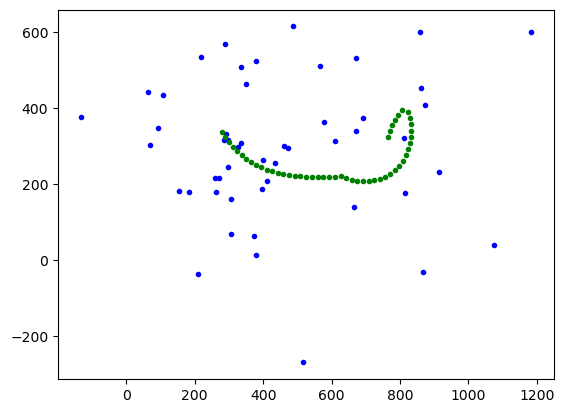

# Surrogate Model for Soft Robot Movement Prediction (DAAD)

## Project Description:

This project is about using surrogate modelling techniques to capture and predict the movement of a simulated soft robot in 2D. Surrogate model is a method to solve a computationally expensive blackbox by building a simplified, middle-or-low-fidelity, but quick model from the real situations. This allows quicker run time to reach the answer and helps us do further actions in a more accountable way. 

We started from _220302_data_creation_for_NN_ADDITIONAL_FUNCTIONS.py. This is a file that creates real data and define some needed definitions. And in surrogate_model.py, we try to use Kriging method and KPLS method to test on the feasibility of implementing surrogate model. 

The guide for using surrogate_model.py file is in the following:

1. This is a cell-based script operated via jupyter.
2. the first cell is importing relevant library.
3. the second cell we read the file from "Data" directory and define the number of points in one configuration, which we will be utilising later.
4. Then there's a defined class that transforms data we read previously into a form that we need for training surrogate models.
5. In the last function of the class, we slice the data into different index group and train model on each one of them using for loop. For instance, the data is grouped by index and the first model is going to predict the 0th position of the path, the second model is going to predict the 1st position of the path, and so on. 
6. The last cell is calling class and execute the code from previous cell. There are some variable that we can change. 
7. Finally, we will get a graph of predicted path and validation path. 

## Result and Discussion

Currently, I am facing kernel crashing problem when running data entries that is more than a certain extent. Also, the accuracy is not promising (following image). 

The blue dots are supposed to predict the green path, but apparently it is not. There might be a few reasons for this. First of all, because the nature of data we are using to train the model is not relevant to each other, that is there is no relationship between the first data entry and the second data entry. Thus, it is reasonable that the machine could not find the pattern clearly. Besides, we have not had the time to do any hyperparameters tuning, model comparison and selection, or even try other ways to treat data. In fact we did try to predict x data and y data with a respective model, However, it was quite an ability beyond current machine. 

All in all, the future work would be choosing the suitable surrogate model method that suits the situation we have here and conduct some hyperparameters tuning on the selected model. 

Surrogate modelling is relatively a new field of study and is certainly still developing. Therefore, there are still a lot to explore in this project and might have hidden potential that we haven't found yet. It's been a great journey to make it this far and I will update if there's anything I have tried and actually works. Thank you!